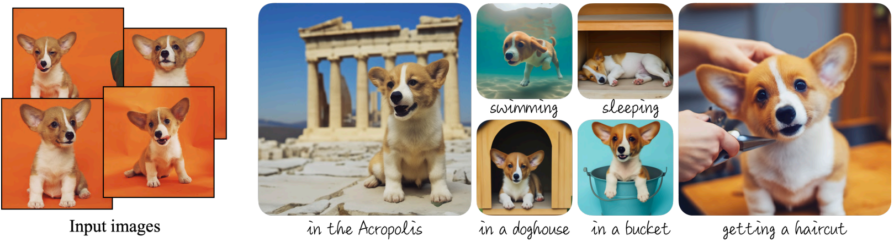
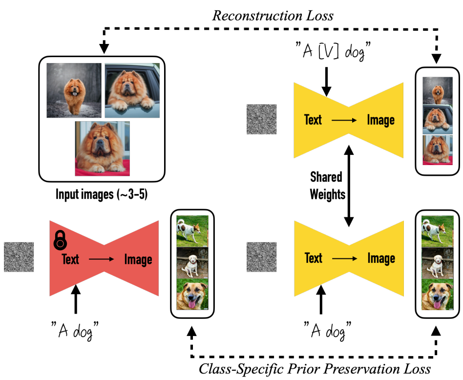

# DreamBooth: Fine Tuning Text-to-Image Diffusion Models for Subject-Driven Generation
This repository contains the code for the paper [DreamBooth: Fine Tuning Text-to-Image Diffusion Models for Subject-Driven Generation](https://arxiv.org/abs/2208.12242) by [Niranjan D.](https://niranjandatta.com/), [Yingtao Tian](https://yingtaotian.com/), [Zhuowen Tu](https://www.soe.ucsc.edu/people/ztu), and [Dilip Krishnan](https://dilipkrishnan.github.io/).



# Core Idea


# Setup
1. Clone the repository and navigate to the project directory:
2. Install the required dependencies:
```bash
make build
```
